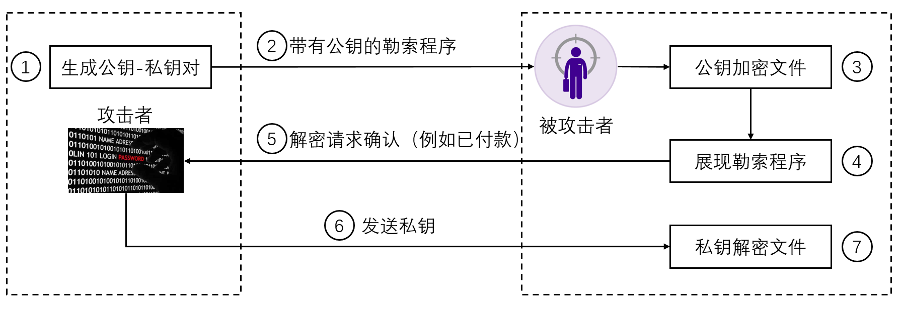

## 多线程&多进程&通信讲座作业

### 阅读材料
5月12日爆发的大规模勒索病毒WannaCry想必广为人知。下图是该勒索病毒中文版的界面。我们这个作业就来实现一部分该病毒的简化版功能。Tips:
我们这里只做练习用途，大家务必不要尝试任何带有破坏性质的东西，特别是对于我们技术爱好者这个红线一定不能碰。


为什么黑客声称自己的加密牢不可破呢？这实际上基本取决于RSA加密算法的可靠性。将两个大素数相乘是一件十分简单的事情。对于两个n位数，可以找到O(n^log3)
复杂度的分治算法。相反，将一个大数做质因数分解将是一个极为困难的任务。RSA正是
基于这一考虑。对于RSA2048(2048bit长的乘积)来说，保密年限可达2030年，如果加密位数更长的话这一年限将更长。因此对于病毒的编写者，
使用RSA来加密可以说底气十足。

RSA由公钥和私钥组成大家在界面中可以看到，可以通过解密按钮来解密一些文件。但中国的用户表示不起作用。这一点我认为很可能是以下原因：
RSA的私钥不可能会随病毒传播，只可能保存了公钥，要想解密必须要通过接入勒索者的服务器（或者各种通信方式）来提供自己的公钥，付款后勒索者再提供私钥。
因此可见这实际上可以用一个简单的通信过程来实现。一种可能的流程图大致如下：


好了阅读材料到此结束，相信大家学完离散，完全可以理解RSA算法。关于RSA算法的细节可以去网上搜。
## 必做部分

RSA算法的安全性很大程度上取决于素数对的选取。素数选取的方法现在主要依赖于素性检验。为简单起见，
我们这里就使用最简单的整除方法来判断。下面给出了一段单线程计算1-100000素数个数的代码。你的任务是完成多线程的实现：
```
import threading
import math
import time
import queue

read = queue.Queue()  # 存放等待判断的数
write = queue.Queue() # 存放素数
def is_prime(m):
    isprime = True
    for i in range(2, int(math.sqrt(m))+1):
        if m % i == 0:
            isprime = False
            break
    return isprime


def main():
    global read
    mult_thread=False
    if(not mult_thread):
        prime=[]
        for i in range(2,100000):
            if is_prime(i):
                prime.append(i)
        print(len(prime))
    else:
        #在这里完成多线程的实现，将结果存放在write中


if __name__ == '__main__':
    start = time.clock()
    main()
    end = time.clock()
    print("runs %f s" % (end - start))
```

你可以比较一下单线程和多线程的运行速度，你很可能会发现多线程远远慢于单线程，思考一下原因。

## 强烈推荐的选做部分

虽然我自己都承认这部分真的比较难，不过不选做一下怎么写Wannacry23333。相关的通信代码强烈建议直接从网上copy然后改。

好了关于RSA我给出了一段十分简单的代码。你可以直接调用接口，也可以自己重新实现练习一下，但在C++端你可能需要重新实现。
由于C++端对于大数的操作比较不便，你可以修改RSA模块默认的素数来简化C++编写。
你的任务如下：仿照之前的流程图，在python端作为Server, C++端作为Client进行连接。Python端选择一对素数对产生公钥和私钥，然后发送公钥给C++端进行某个文件的加密,
然后输出提示文件被加密，需要`女装`才能解密。C++端再给Python端发出一个信号，具体是什么可以自行约定，不过最好是ascii字符，比如`boss_iu_nz.jpg`。Python端
收到后给C++端发送私钥，C++端收到后对文件进行解密。
```
class RSA:
    # This is a prime number pair for rsa768
    def __init__(
    self,
    p=33478071698956898786044169848212690817704794983713768568912431388982883793878002287614711652531743087737814467999489,
    q=36746043666799590428244633799627952632279158164343087642676032283815739666511279233373417143396810270092798736308917,
                 e=65537
                 ):
        self.p = p
        self.q = q
        self.e = e
        self.n = p * q
        self.phi = (p - 1) * (q - 1)
        self.d = self.ext_euclid(e, self.phi)[1] % self.phi

    # extended euclid algorithm
    def ext_euclid(self, a, b):
        if b == 0:
            return (a, 1, 0)
        d, x, y = self.ext_euclid(b, a % b)
        return (d, y, x - a // b * y)

    # fast mod
    def mod(self, a, n, c):
        pow = 1
        while (n):
            if (n & 1):
                pow = (pow * a) % c
            a = (a * a) % c
            n >>= 1
        return pow

    # encrypt a number or a char
    def encrypt_number(self,c):
        if type(c)==int:
            return self.mod(c,self.e,self.n)
        if type(c)==str:
            # use ascii code
            return self.mod(ord(c), self.e, self.n)

    # decrypt a number
    def decrypt_number(self, pw):
        return self.mod(pw, self.d, self.n)

    # encrypt a string by ascii code.
    def encrypt_string(self, s):
        return list(map(self.encrypt_number,s))

    # decrypt a list.
    def decrypt_array2array(self, array):
        return list(map(self.decrypt_number, array))

    # decrypt a list and join it to a string.
    def decrypt_array2str(self, array):
        return "".join(map(lambda x:chr(x),self.decrypt_array2array(array)))

#demo
def main():
    rsa768=RSA()
    test=[1,2,3,4]
    encrypt=rsa768.encrypt_string(test)
    decrypt=rsa768.decrypt_array2array(encrypt)
    print(encrypt)
    print(decrypt)
    test2="wannacry"
    encrypt=rsa768.encrypt_string(test2)
    decrypt=rsa768.decrypt_array2str(encrypt)
    print(encrypt)
    print(decrypt)
    
    
if __name__ == '__main__':
    main()
    
```

